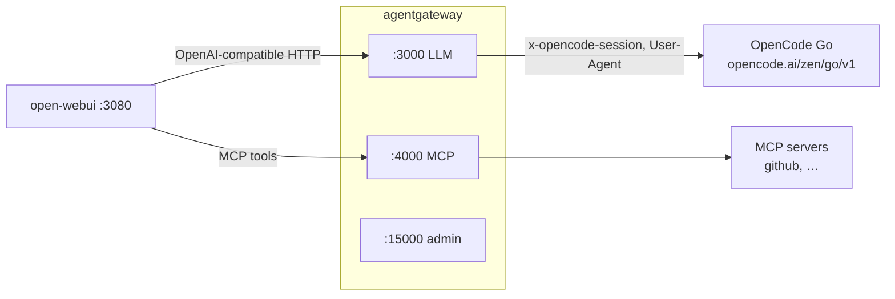
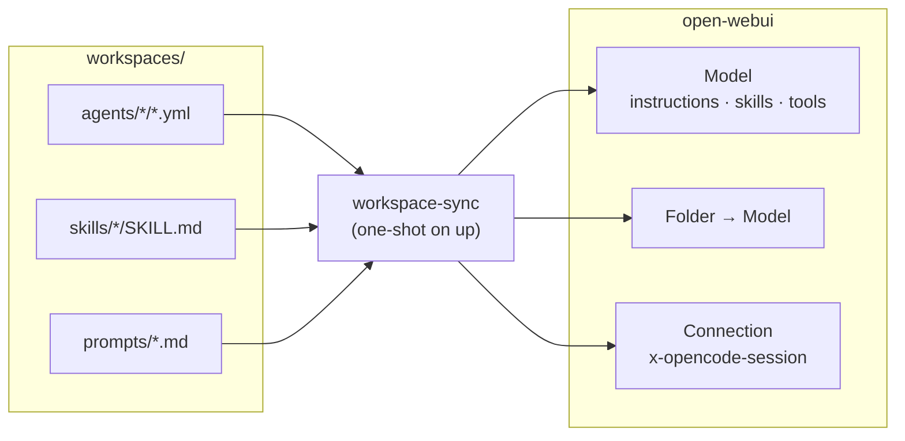

# OpenCode Agent Gateway

A self-hosted, OpenAI-compatible gateway in front of **OpenCode Go**, plus a chat
UI and a set of per-workspace **agents**. Point any OpenAI client at
`http://localhost:3000/v1` and it is backed by your OpenCode Go subscription.

Two containers:

- **[agentgateway](https://agentgateway.dev/)** — the LLM gateway. Holds your Go
  API key, exposes an OpenAI-compatible API, lists the Go models, and derives a
  stable session ID per conversation.
- **[open-webui](https://openwebui.com/)** — a browser chat UI, pre-wired to talk
  to the gateway instead of to a provider directly.

## What you get

| Surface | URL | Purpose |
|---|---|---|
| LLM API | `http://localhost:3000/v1` | OpenAI-compatible endpoint (`/models`, `/chat/completions`) |
| Chat UI | `http://localhost:3080` | open-webui |
| Admin / gateway UI | `http://localhost:15000/ui` | Edit config, view request Logs / Analytics / Costs, metrics |

- One place for the OpenCode Go key — the browser and open-webui never see it.
- The full list of Go models in the model picker, plus two aliases (`fast`, `smart`).
- A stable `x-opencode-session` per conversation, so Go can route requests and
  reuse prompt caches efficiently.
- Per-workspace **agents** (frontend, frontend-vue, backend, …) in the model
  picker, defined as YAML in this repo and synced into open-webui on `up`.

## How it works

Two layers: the **gateway** is shared infrastructure, and the **agents** are
per-workspace bundles built on top of it.





- **Gateway (shared).** The OpenCode Go connection — one API key, one model
  catalog, one session policy — plus the MCP servers every model can call,
  multiplexed into a single endpoint. Declared in `config.yml`.
- **Agents (per workspace).** YAML under `workspaces/agents/` — an inline system
  prompt, skills and MCPs — reconciled into an open-webui **Model** and **Folder**.
  Agents share skills and extend one another with `extends:`.
- **`workspace-sync`** is the bridge: on every `up` it reads the repo and upserts
  the models, skills, prompts and folders to match.

Details: [Architecture](docs/architecture.md) · [Agents](docs/agents.md).

## Quick start

You need Docker (Compose v2) and an **OpenCode Go** subscription/API key
(<https://opencode.ai/auth>). [mise](https://mise.jdx.dev/) is optional and wraps
the same commands.

### With mise

```bash
mise install          # once: pins the Python used by the `models`/`smoke` tasks
cp .env.example .env
$EDITOR .env          # add your Go API key (OPENCODE_API_KEY)

mise run up           # start the stack
mise run models       # confirm the gateway sees your models
```

### Without mise

```bash
cp .env.example .env
$EDITOR .env          # add your Go API key (OPENCODE_API_KEY)

docker compose up -d
curl -s http://localhost:3000/v1/models | jq -r '.data[].id'
```

Then open the chat UI at <http://localhost:3080> (create the first admin account
on first run).

### Smoke test

```bash
# with mise
mise run smoke

# without
curl -s http://localhost:3000/v1/chat/completions \
  -H 'content-type: application/json' \
  -d '{"model":"glm-5.3-flash","max_tokens":32,
       "messages":[{"role":"user","content":"Say hi in three words."}]}' | jq .
```

### Agents in the chat UI

To have the session header and the agents set up automatically on `up`, also set
the workspace credentials in `.env` (`WEBUI_ADMIN_EMAIL` +
`WEBUI_ADMIN_PASSWORD`, or `OPENWEBUI_API_KEY`), then:

```bash
mise run workspaces        # dry-run: the resolved plan
mise run sync-workspaces   # apply to open-webui
```

## Documentation

| Doc | What's in it |
|---|---|
| [Architecture](docs/architecture.md) | The two layers, the request path, and the per-chat session header. |
| [Configuration](docs/configuration.md) | `config.yml` reference, models and aliases, hot-reload, env vars. |
| [Agents](docs/agents.md) | What an agent is, what it maps to, extending and sharing, sync behaviour. |
| [workspaces/README.md](workspaces/README.md) | Full agent YAML schema, `extends` merge rules, worked examples. |
| [Operations](docs/operations.md) | Commands, lifecycle, volumes, teardown, notes and limits. |
| [Troubleshooting](docs/troubleshooting.md) | Symptom → cause/fix table. |

## Repository layout

```
.
├── .env.example         # copy to .env and fill in
├── mise.toml            # task runner (up, logs, models, smoke, sync, ...)
├── config.yml           # agentgateway config (provider, models, logging, database, session policy, MCP)
├── docker-compose.yml   # agentgateway + open-webui + workspace-sync
├── workspaces/          # agent bundles reconciled into open-webui
│   ├── README.md        # full agent reference
│   ├── agents/          # one YAML per agent (+ optional local skills/mcps)
│   ├── skills/          # shared skill library
│   ├── mcps/            # shared MCP library (JSON)
│   └── prompts/         # global slash-command prompts
├── scripts/
│   ├── Dockerfile       # workspace-sync image (PyYAML baked in)
│   ├── requirements.txt
│   └── workspace_sync/  # sync package (python -m workspace_sync)
├── tests/               # unittest suite for the sync
├── docs/                # documentation pages + screenshots
└── README.md
```

## References

- agentgateway docs — <https://agentgateway.dev/docs/standalone/latest/>
- Custom LLM provider — <https://agentgateway.dev/docs/standalone/latest/integrations/llm/providers/custom/>
- LLM request transformations — <https://agentgateway.dev/docs/standalone/latest/documentation/llm/transformations/>
- Access logs to a database — <https://agentgateway.dev/docs/standalone/latest/documentation/observability/access-logs/database/>
- Cost dashboard (UI) — <https://agentgateway.dev/docs/standalone/latest/documentation/llm/cost-controls/dashboard/>
- Debugging (log levels) — <https://agentgateway.dev/docs/standalone/latest/documentation/operations/debug/>
- CEL variables and functions — <https://agentgateway.dev/docs/standalone/latest/reference/cel/variables/>
- Virtual models — <https://agentgateway.dev/docs/standalone/latest/documentation/llm/virtual-models/>
- OpenCode Go — <https://opencode.ai/docs/go/>
- open-webui docs — <https://docs.openwebui.com/>
