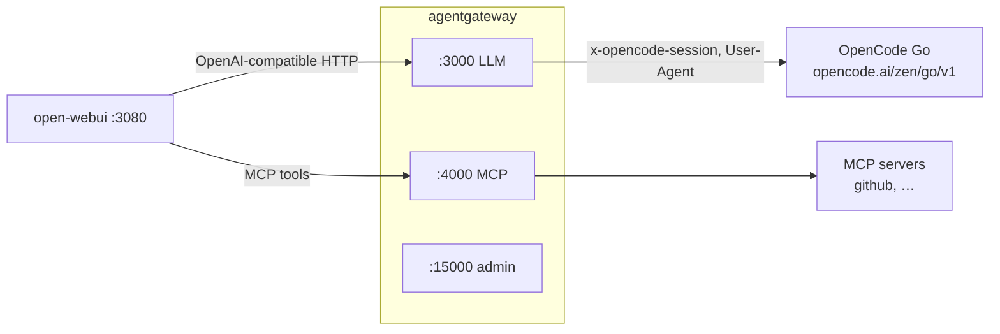
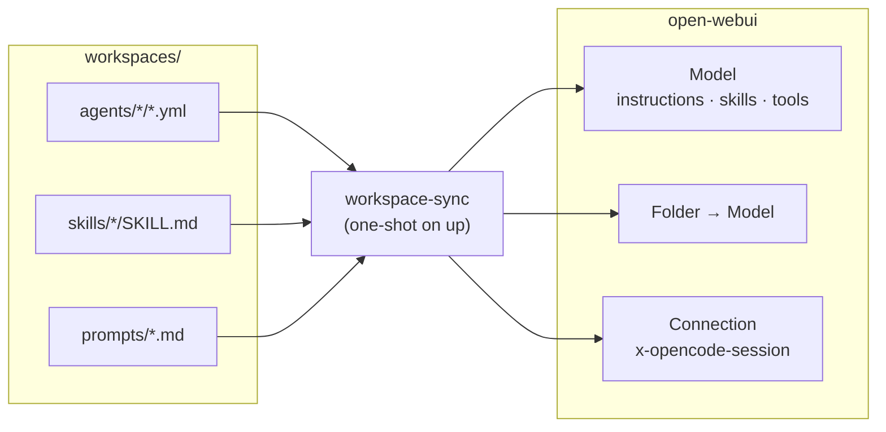
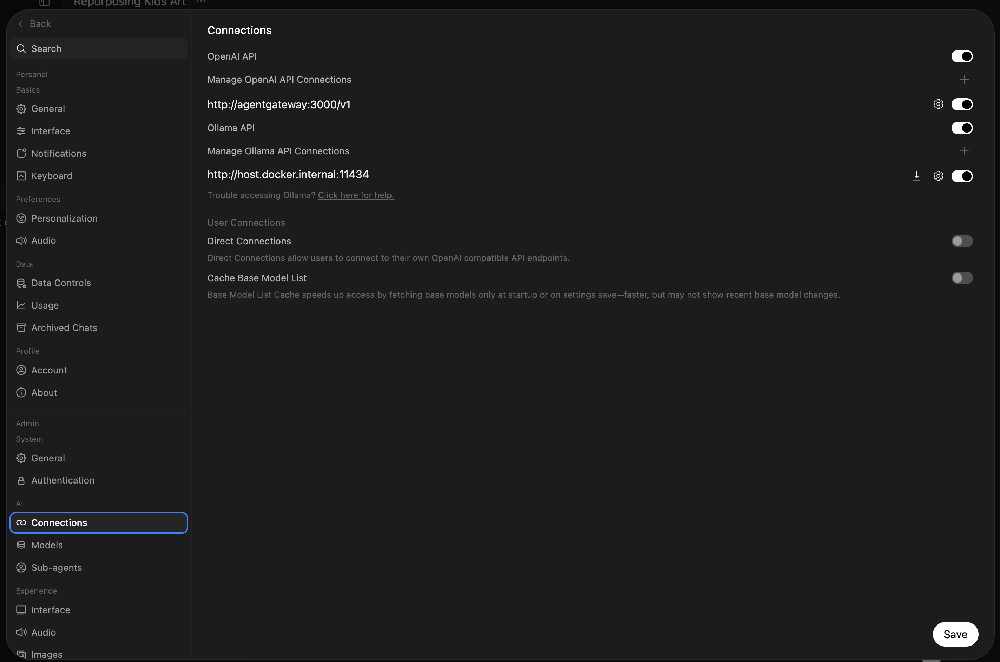
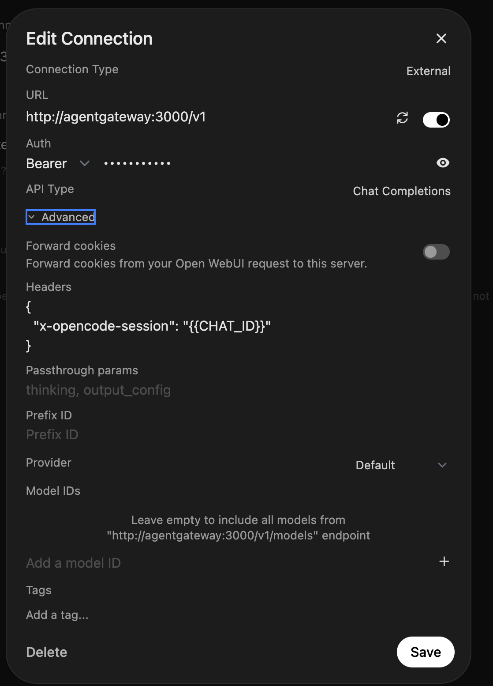

# OpenCode Agent Gateway

A self-hosted, OpenAI-compatible gateway in front of **OpenCode Go**, plus a chat
UI. Point any OpenAI client at `http://localhost:3000/v1` and it is backed by your
OpenCode Go subscription.

Two containers:

- **[agentgateway](https://agentgateway.dev/)** — the LLM gateway. Holds your Go
  API key, exposes an OpenAI-compatible API, lists the Go models, and derives a
  stable session ID per conversation.
- **[open-webui](https://openwebui.com/)** — a browser chat UI, pre-wired to talk
  to the gateway instead of to a provider directly.

---

## What you get

| Surface | URL | Purpose |
|---|---|---|
| LLM API | `http://localhost:3000/v1` | OpenAI-compatible endpoint (`/models`, `/chat/completions`) |
| Chat UI | `http://localhost:3080` | open-webui |
| Admin / gateway UI | `http://localhost:15000/ui` | Edit config, view request Logs / Analytics / Costs, metrics |

- One place for the OpenCode Go key — the browser and open-webui never see it.
- The full list of Go models in the model picker, plus two aliases (`fast`, `smart`).
- A stable `x-opencode-session` per conversation, so Go can route requests and
  reuse prompt caches efficiently.

---

## Architecture

Two layers: the **gateway** is shared infrastructure, and the **agents** are
per-workspace bundles built on top of it.

**Runtime** — the request path:



**Provisioning** — how this repo reaches the UI:



- **Gateway (shared).** The OpenCode Go connection — one API key, one model
  catalog, one `x-opencode-session` policy — plus the MCP servers **every model**
  can call (GitHub, …), multiplexed into a single endpoint on `:4000`. Both are
  declared in `config.yml`.
- **Agents (per workspace).** YAML under `workspaces/agents/` — an inline system
  prompt, skills and MCPs — reconciled into an open-webui **Model** and a
  **Folder** bound to it, so each agent is its own entry in the model picker and
  its own place in the sidebar. Agents can share skills (`workspaces/skills/`)
  and extend one another with `extends:`.
- **`workspace-sync`** is the bridge: on every `up` it reads the repo, sets the
  connection's session header, and upserts the models, skills, prompts and
  folders to match.

Any other OpenAI client (a script, an SDK, your own agent) can use
`http://localhost:3000/v1` the same way.

---

## Prerequisites

- Docker with Docker Compose v2 (`docker compose ...`)
- An **OpenCode Go** subscription and API key: <https://opencode.ai/auth>
- [mise](https://mise.jdx.dev/) — for the `mise run <task>` shortcuts and the pinned Python used by `models`/`smoke` and the local `workspaces` dry-run (run `mise install`, then `mise run setup-deps` once for PyYAML). Optional: the raw `docker compose` commands and a system `python3` work without it. `mise run prereqs` checks docker/compose/curl/python.

---

## Quick start

Two equivalent paths — the `mise` tasks wrap the same `docker compose` commands.
Pick one.

### With mise

```bash
mise install          # once: pins the Python used by the `models`/`smoke` tasks
cp .env.example .env
$EDITOR .env          # add your Go API key (OPENCODE_API_KEY)

mise run up           # start the stack
mise run models       # confirm the gateway sees your models
```

### Without mise

```bash
cp .env.example .env
$EDITOR .env          # add your Go API key (OPENCODE_API_KEY)

docker compose up -d
curl -s http://localhost:3000/v1/models | jq -r '.data[].id'
```

Then open the chat UI at <http://localhost:3080> (create the first admin account on
first run). To have the session header and the agents set up automatically on
`up`, also set the workspace credentials in `.env` (see
[Workspaces](#workspaces-agents-in-the-chat-ui)).

### Smoke test from the command line

```bash
# with mise
mise run smoke

# without
curl -s http://localhost:3000/v1/chat/completions \
  -H 'content-type: application/json' \
  -d '{"model":"glm-5.3-flash","max_tokens":32,
       "messages":[{"role":"user","content":"Say hi in three words."}]}' | jq .
```

Or use an alias:

```bash
curl -s http://localhost:3000/v1/chat/completions \
  -H 'content-type: application/json' \
  -d '{"model":"fast","messages":[{"role":"user","content":"hello"}]}' | jq .
```

---

## The per-chat session header

The gateway derives a stable session per conversation from an
`x-opencode-session` header. **`workspace-sync` sets it for you** on open-webui's
OpenAI connection, so there is nothing to do by hand:

```json
{ "x-opencode-session": "{{CHAT_ID}}" }
```

`{{CHAT_ID}}` is interpolated by open-webui per chat. The header lives on the
connection in open-webui's database (the `open-webui` volume) and is re-applied
on every `docker compose up`.

If you are not running the sync, set it manually — **Settings → Admin → Connections
→** your OpenAI connection → **Custom headers**:



set it to the JSON above, save, and click the connection's **refresh** icon so
the model list is re-fetched:



On a fresh install you can also seed it declaratively with open-webui's
`OPENAI_API_CONFIGS` env var, e.g.
`{"0":{"headers":{"x-opencode-session":"{{CHAT_ID}}"}}}` — but it is a persisted
setting, so it is only read while no value is stored.

Without this header the gateway still gives each chat its own session by hashing
the first user message, so it works either way — the header just makes it exact.

---

## Workspaces (agents in the chat UI)

The gateway is the shared infrastructure — providers, models and MCP servers
declared in `config.yml`. An **agent** is the other half: one workspace
(frontend, frontend-vue, backend, …) declared as YAML and reconciled into
open-webui's **Workspace**, so each agent shows up in the model picker as its
own agent.

```
workspaces/
├── agents/frontend/frontend.yml           # metadata + inline system prompt
├── agents/frontend/skills/…/SKILL.md      # local skills (attached implicitly)
├── agents/frontend-vue/frontend-vue.yml   # extends: frontend
├── skills/<id>/SKILL.md                   # shared skill library
├── mcps/agentgateway.json                 # shared MCP library
└── prompts/review-ui.md                   # global slash command (/review-ui)
```

`scripts/workspace_sync/` reads those files and upserts, per agent:

- a **Model** preset (id = agent id) on top of `base_model`, with the inline
  system prompt, the bound **Skills** and the MCP tool ids from `mcps`;
- one **Skill** per distinct skill used (a local `skills/*/SKILL.md` or a shared
  `skills/<id>/SKILL.md`), lazy-loaded by the model on demand;
- one **Prompt** per `prompts/*.md`;
- a sidebar **Folder** bound to the model, so a chat opened in "Frontend" starts
  on the Frontend agent.

An agent can extend another with `extends:` — lists spread, `params` deep-merge,
`prompt_append` is concatenated — so a specific "frontend-vue" agent reuses the
generic "frontend" one. `publish: false` marks an extend-only base.

It runs automatically on `docker compose up` (the one-shot `workspace-sync`
service), so a fresh stack comes up with the agents already bundled in the UI.
Re-run it after editing YAML:

```bash
mise run workspaces        # dry-run: resolved plan (once: mise run setup-deps)
mise run sync-workspaces   # apply to open-webui
```

The sync authenticates from `.env` with either `WEBUI_ADMIN_EMAIL` +
`WEBUI_ADMIN_PASSWORD` (which also creates the first admin headlessly on a fresh
install) or an `OPENWEBUI_API_KEY`. Without either it exits 0 and changes
nothing. Everything is upserted by id, so re-running is safe; `--prune` removes
workspace-managed items that no longer exist in the repo.

Full reference: [`workspaces/README.md`](workspaces/README.md).

---

## How it works

### The provider

`config.yml` defines one custom provider named `go`:

```yaml
providers:
- name: go
  provider:
    custom:
      formats: [{ type: completions }]
  params:
    apiKey: "$OPENCODE_API_KEY"
    baseUrl: "https://opencode.ai/zen/go/v1"
```

OpenCode Go normalizes its whole catalog to the OpenAI **Chat Completions** API,
so a single `completions` format covers every model. `$OPENCODE_API_KEY` is read
from the container environment at startup.

### The models

- **Public models** (the 29 explicit entries) are what show up in `/v1/models` and
  in open-webui's picker: `glm-5.3-flash`, `kimi-k2.7-code`, `qwen3.8-max`,
  `deepseek-v4.1-flash`, `grok-4.7`, and so on.
- **`*` with `visibility: internal`** is a catch-all that is **not** listed and
  **cannot** be requested directly. It exists only as a backing target for virtual
  models. This is deliberate: if the wildcard were public, it would be advertised
  as a model literally named `*`, which Go rejects with
  `Upstream request failed: Model is unavailable.`
- **Virtual models**:
  - `fast` — weighted across `glm-5.3-flash` (60%) and `mimo-v2.6-flash` (40%),
    for bulk sub-agent work.
  - `smart` — failover from `kimi-k2.7-code` to `glm-5.2`, for planning/review.

### The session header (why the transformation exists)

OpenCode Go requires a stable `x-opencode-session` per conversation and returns
`Request is missing x-opencode-session` without one. agentgateway translates the
request into the provider's wire format, which rebuilds the upstream request and
drops client headers — so the gateway re-adds it:

```yaml
policies:
  transformations:
    request:
      set:
        x-opencode-session: |
          coalesce(
            request.headers["x-opencode-session"],
            request.headers["x-openwebui-chat-id"],
            json(request.body).chat_id,
            sha256.encode(string(json(request.body).messages.filter(m, m.role == "user")[0].content)),
            uuid()
          )
        User-Agent: '"agent-gateway/1.0"'
```

Priority order, first match wins (`coalesce` swallows errors from earlier branches):

1. an explicit `x-opencode-session` from the client (your own agent, or open-webui
   once the custom header is set),
2. open-webui's built-in `x-openwebui-chat-id` header,
3. a `chat_id` carried in the request body,
4. a SHA-256 of the **first user message** — stable across turns because the
   message history only appends, so any client gets a working per-chat session
   with zero configuration,
5. `uuid()` — only if the content cannot be hashed (e.g. multimodal message parts).

---

## Configuration reference (`config.yml`)

| Field | Meaning |
|---|---|
| `config.adminAddr` | Admin UI bind address. Set to `0.0.0.0:15000` so the Docker port mapping can reach it (startup-only; restart after changing). |
| `config.storage.mode` | How UI-managed config is persisted. `hybrid` (set here) keeps `config.yml` as the documented baseline and stores UI-created resources in the database, so the UI never rewrites the file. Alternatives: `file` (UI writes to the file — strips comments), `readOnly` (UI cannot write). Startup-only. |
| `config.logging.level` | Log verbosity: `error`/`warn`/`info`/`debug`/`trace`, or per-module (`info,proxy::httpproxy=trace`). Set to `debug` here. Startup-only; change it live at `http://localhost:15000/logging`. |
| `config.logging.format` | Log output format: `text` (default) or `json`. Set to `json` here. |
| `config.database.url` | Database behind the UI's **Logs / Analytics / Costs** pages; setting it also persists access logs to a `request_logs` table. SQLite or PostgreSQL. Set to SQLite at `/data/agentgateway.db`. Startup-only. |
| `llm.port` | Port the OpenAI-compatible API is served on (container `3000`). |
| `llm.providers[]` | Reusable provider definitions; referenced by `provider.reference`. |
| `llm.models[].name` | The model name clients request (and that appears in `/v1/models`). |
| `llm.models[].visibility` | `public` (default, listed + requestable) or `internal` (hidden, not directly requestable). |
| `llm.models[].provider` | `{ reference: go }` points at the provider above. |
| `llm.virtualModels[]` | Aliases that route across concrete models (`weighted`, `failover`, `conditional`). |
| `llm.policies.transformations.request.set` | Header rewrites applied before the request goes upstream (CEL expressions). |

**Add a model** — copy a line in the `models:` list, or add any Go model ID and
restart/reload. **Add an alias** — add an entry under `virtualModels:` targeting
existing model names.

### Editing config

`config.yml` is bind-mounted **read-write**, and `config.storage.mode: hybrid`
keeps it as the documented baseline:

- **On the host** — edit `config.yml` directly. It is the source of truth for
  everything in it, comments included.
- **In the admin UI** (`http://localhost:15000/ui`) — resources you create in the
  UI are stored in the `agentgateway-data` database, not written back to this
  file, so the file (and its comments) is never rewritten. (With the `file`
  default, the UI rewrites `config.yml` and strips its comments.)

How a change is applied depends on the section:

- **`llm.*`** (models, providers, policies, virtual models) is **hot-reloaded** — no
  restart. Watch for `loaded config from File("/config.yml")` in the logs.
- **`config.*`** (`adminAddr`, `storage`, `logging`, `database`, `tracing`, …) is
  **startup-only** — it is read once at startup, so either restart
  (`docker compose restart agentgateway`) or set the field before the first start.

### Environment variables

| Variable | Required | Used by | Notes |
|---|---|---|---|
| `OPENCODE_API_KEY` | yes | agentgateway | Your OpenCode Go key. |

Referenced env vars are resolved at config load. If one is missing, agentgateway
**fails to start** (`error looking key '...' up: environment variable not found`) —
it does not fall back to a default.

---

## Operations

```bash
docker compose up -d          # start / apply changes
docker compose ps             # status
docker compose logs -f agentgateway   # gateway logs (every request is logged)
docker compose logs -f open-webui     # UI logs
docker compose pull && docker compose up -d   # update images
docker compose down           # stop (keeps the open-webui and agentgateway-data volumes)
docker compose down -v        # stop AND delete containers, networks and volumes (wipes all data)
```

`mise run destroy` wraps the destructive one with a confirmation prompt; `-y`
(or `FORCE=1`) skips it for scripting and tests:

```bash
mise run destroy        # asks for confirmation
mise run destroy -y     # no prompt
```

It deletes the open-webui volume (accounts, chats, settings) and the
agentgateway-data volume (request logs). Pulled images are left in place; add
`--rmi all` if you want those gone too.

The `mise.toml` tasks wrap the common commands: `mise run up`, `down`, `restart`,
`logs`, `models`, `smoke`, `pull`, `config`, `setup-deps`, `sync-workspaces`,
`workspaces`, and `destroy` (`mise tasks` lists them all).

- `config.yml` is mounted **read-write** and is edited on the host.
  `config.storage.mode: hybrid` sends UI-created resources to the database, so the
  file is never rewritten (see [Editing config](#editing-config)).
- **`llm.*` changes** are **hot-reloaded** — no restart needed (watch for
  `loaded config from File("/config.yml")` in the logs).
- **`config.*` changes** (admin address, logging, database) are **startup-only** —
  restart the container: `docker compose restart agentgateway`.
- **Env var changes** require a restart: `docker compose up -d --force-recreate`.
- open-webui data (accounts, chats, connection settings) lives in the
  `open-webui` named volume.
- The gateway's request-log database (behind the UI Logs/Analytics pages) lives in
  the `agentgateway-data` named volume. `docker compose down` keeps it;
  `docker compose down -v` deletes it, along with the logs.

---

## Troubleshooting

| Symptom | Cause / fix |
|---|---|
| `Request is missing x-opencode-session` | The request transformation is missing or the config did not reload. Check `config.yml` and the gateway logs for `loaded config`. |
| `Upstream request failed: Model is unavailable.` | A client sent `model: "*"`. The wildcard must stay `visibility: internal`. In open-webui, refresh the connection's model list and pick a real model or `fast`/`smart`. |
| `404 Model not found` from the gateway | The requested model is not one of the public entries. Add it to `config.yml`. |
| `error looking key 'OPENCODE_API_KEY' up` at startup | `.env` is missing or the variable is not set. Recreate with `docker compose up -d --force-recreate`. |
| open-webui shows no models | Refresh the connection (Settings → Admin → Connections). Check the base URL is `http://agentgateway:3000/v1` and the key is non-empty (a placeholder is fine — the gateway substitutes the real one). |
| open-webui still lists a stale `*` model | Hard-reload the page / click the connection's refresh icon; the list is cached client-side. |
| `http://localhost:15000` won't load | The admin UI binds to loopback inside the container by default, which a Docker port mapping cannot reach. `config.adminAddr: "0.0.0.0:15000"` is set in `config.yml`; it is startup-only, so restart the container after changing it. |
| Admin UI save fails with `Read-only file system (os error 30)` | `config.yml` is mounted `:ro` in `docker-compose.yml`, so the UI cannot write back. Drop the `:ro` suffix (see [Editing config](#editing-config)). |
| UI Logs page: `request log database is not configured` | No database is set. Add `config.database.url` (see [Editing config](#editing-config)) and restart. `config.logging.level`/`format` only affect the stdout stream, not the UI. |
| UI Logs page: `disk I/O error (code: 522)` | The SQLite DB is on a Docker Desktop **bind mount**. Use a named volume (`agentgateway-data:/data`) instead — SQLite's locking/mmap is unreliable on macOS file sharing. |
| Gateway exits with `failed to connect sqlite database` / `unable to open database file` | The `agentgateway-data` volume is root-owned but the gateway runs as uid `65532`, so it cannot create the DB. The `agentgateway-data-init` service chowns the volume on every `up` (this also repairs it after `mise run destroy`). If you removed that service, run `docker run --rm -v agent-gateway_agentgateway-data:/data alpine chown -R 65532:65532 /data` and start again. |
| Go returns `429` | A model hit its Go usage cap. Enable **Use balance** in the Zen console, or route around it (see `smart`). |

---

## Notes and limits

- **Published ports:** the admin UI (`15000`) is published on host loopback only
  (`127.0.0.1:15000`) because it is unauthenticated. The LLM API (`3000`) and chat
  UI (`3080`) are published on all interfaces; change them to
  `127.0.0.1:3000:3000` / `127.0.0.1:3080:8080` in `docker-compose.yml` to restrict
  them to this machine.
- **The Go key lives only in the `agentgateway` container.** open-webui uses the
  literal key `placeholder`; the gateway replaces the auth header with the real key.
- Go usage is capped **per model** on 5-hour / weekly / monthly buckets. See the
  [Go docs](https://opencode.ai/docs/go/) for current limits.
- Multimodal messages (content as a list) fall through to a random `uuid()`
  session, so they do not share a prompt cache. To keep those stable too, hash the
  first text part instead of the raw content in the `coalesce` chain.
- **Do not open the request-log SQLite DB from the host while the gateway is
  running.** Two writers across Docker Desktop's file sharing corrupt the WAL and
  cause `disk I/O error (522)`. To inspect it, stop the gateway first and read the
  `agentgateway-data` volume from a throwaway container.
- **The Logs DB stores request metadata, not message content** (model, status,
  tokens, duration, cost). To also capture prompts/completions, add
  `frontendPolicies.accessLog.database.llm: full`.
- **`config.logging.level: debug` is verbose** — it logs every SQL statement. Drop
  to `info` for normal use (`curl -X POST "http://localhost:15000/logging?level=info"`).

---

## Repository layout

```
.
├── .env.example         # copy to .env and fill in
├── .gitignore
├── mise.toml            # task runner (up, logs, models, smoke, sync, ...)
├── config.yml           # agentgateway config (provider, models, logging, database, session policy, MCP)
├── docker-compose.yml   # agentgateway + open-webui + workspace-sync
├── workspaces/          # agent bundles reconciled into open-webui
│   ├── README.md
│   ├── agents/          # one YAML per agent (+ optional local skills/mcps)
│   ├── skills/          # shared skill library
│   ├── mcps/            # shared MCP library (JSON)
│   └── prompts/         # global slash-command prompts
├── scripts/
│   ├── Dockerfile       # workspace-sync image (PyYAML baked in)
│   ├── requirements.txt
│   └── workspace_sync/  # sync package (python -m workspace_sync)
├── tests/               # unittest suite for the sync
├── docs/                # screenshots used by this README
│   ├── connection-headers.png
│   └── connection-settings.png
└── README.md
```

---

## References

- agentgateway docs — <https://agentgateway.dev/docs/standalone/latest/>
- Custom LLM provider — <https://agentgateway.dev/docs/standalone/latest/integrations/llm/providers/custom/>
- LLM request transformations — <https://agentgateway.dev/docs/standalone/latest/documentation/llm/transformations/>
- Access logs to a database — <https://agentgateway.dev/docs/standalone/latest/documentation/observability/access-logs/database/>
- Cost dashboard (UI) — <https://agentgateway.dev/docs/standalone/latest/documentation/llm/cost-controls/dashboard/>
- Debugging (log levels) — <https://agentgateway.dev/docs/standalone/latest/documentation/operations/debug/>
- CEL variables and functions — <https://agentgateway.dev/docs/standalone/latest/reference/cel/variables/>
- Virtual models — <https://agentgateway.dev/docs/standalone/latest/documentation/llm/virtual-models/>
- OpenCode Go — <https://opencode.ai/docs/go/>
- open-webui docs — <https://docs.openwebui.com/>
