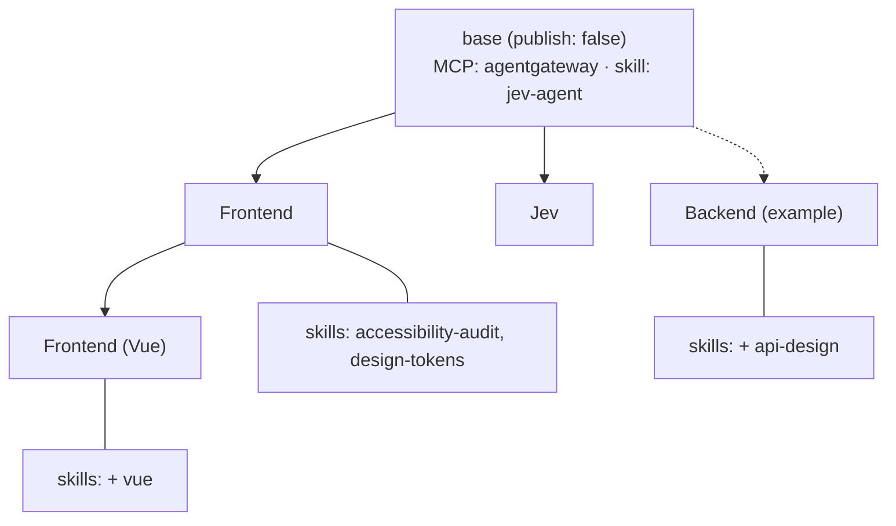

# Agents

[Home](../README.md) · [Architecture](architecture.md) · [Configuration](configuration.md) · [Operations](operations.md) · [Troubleshooting](troubleshooting.md)

An **agent** is one workspace — a domain bundle (frontend, frontend-vue, backend,
…) declared as YAML and reconciled into an open-webui **Workspace**. Each agent
becomes its own entry in the model picker and its own folder in the sidebar.

Agents live under `workspaces/` and are synced by the `workspace_sync` package in
`scripts/`.

```
workspaces/
├── agents/
│   ├── base/                              # shared baseline (publish: false)
│   │   └── base.yml                       # extends target for every agent
│   ├── frontend/                          # folder form (canonical)
│   │   ├── frontend.yml                   # metadata + inline system prompt
│   │   ├── skills/<id>/SKILL.md           # local skills (attached implicitly)
│   │   └── mcps/<name>.json               # local MCPs (attached implicitly)
│   ├── frontend-vue/
│   │   └── frontend-vue.yml               # extends: frontend (which extends: base)
│   └── quick.yml                          # flat form: single-file agent
├── skills/<id>/SKILL.md                   # shared skill library (by id)
├── mcps/<name>.json                       # shared MCP library (by name)
└── prompts/<command>.md                   # global slash-command prompts
```

## The baseline

`agents/base/base.yml` is the shared baseline every published agent inherits
with `extends: base`. It is `publish: false`, so it becomes no Model and no
folder — but its `mcps` and `skills` spread into each agent. It holds the
`agentgateway` MCP and the `jev-agent` skill today, so agents stop repeating
them. Capabilities every agent needs belong there; agent-specific skills stay in
the agent's own `skills/`. The baseline sets no `prompt` and no `base_model`, as
those are per-agent (see [Sharing and spreading](#sharing-and-spreading-extends)).

## Inheritance

Every published agent extends `base`; an agent may extend another agent in turn,
and the chain resolves recursively (a cycle is an error). Solid edges are real
agents in the repo; the dashed edge points at an illustrative `backend` you
could add.



Reading it:

- **`base` is never picked.** `publish: false` means no Model and no folder; only
  its `mcps`, `skills` and `params` spread to children.
- **Skills accumulate down the chain.** `Frontend (Vue)` extends `Frontend`,
  which extends `base`, so it carries `jev-agent` + `accessibility-audit` +
  `design-tokens` + `vue` (union, order-preserving, deduped).
- **The dashed edge is the example.** `Backend` is not in the repo; it shows the
  shape a new agent takes — `extends: base`, its own `base_model`, and a local
  `skills/api-design/` — and it inherits the gateway MCP and `jev-agent` for
  free. The full worked example is in
  [`workspaces/README.md`](../workspaces/README.md#adding-an-agent).

## What an agent becomes

| Agent YAML | Becomes in open-webui |
| --- | --- |
| `prompt` | the **Model** system prompt (inline in the YAML) |
| `prompt_append` | appended to the inherited prompt |
| `base_model` | the Model's base model (a gateway model: `smart`, `fast`, …) |
| `skills` | the Model's bound **Skills** (ids from `workspaces/skills/`) |
| `mcps` | the Model's bound tools (names from `workspaces/mcps/`) |
| `tags` | Model tags |
| `folder` | a sidebar **Folder** bound to the Model (default = agent name, `false` disables) |
| `params` | the Model's parameters (optional) |
| `publish` | whether a Model is created (`false` = extend-only base) |
| `skills/<id>/SKILL.md` | a **Skill**, lazy-loaded on demand |
| `prompts/<name>.md` | a **Prompt** slash command (`/name`), global to open-webui |

## Extending and sharing

An agent can inherit another with `extends:` — lists spread, `params` deep-merge,
`prompt` is replaced, and `prompt_append` is concatenated — so a specific
"frontend-vue" agent reuses the generic "frontend" one. Every agent extends the
shared **`base`** baseline (`publish: false`, so it is never a Model), which is
where capabilities common to all agents live. Skills and MCPs live either
**locally** (in the agent's folder, attached implicitly) or in the **shared**
libraries (`workspaces/skills/`, `workspaces/mcps/`) and are pulled in by
id/name. A local entry shadows a shared one with the same id.

The full YAML schema, merge rules and worked examples are in
[`workspaces/README.md`](../workspaces/README.md).

## Sync behaviour

The sync runs automatically on `docker compose up` (the one-shot `workspace-sync`
service), so a fresh stack comes up with the agents already bundled in the UI.
Re-run it after editing YAML:

```bash
mise run workspaces        # dry-run: resolved plan (once: mise run setup-deps)
mise run sync-workspaces   # apply to open-webui
```

- **Upsert by id**: skills by skill id, prompts by command, models by model id.
  Re-running never duplicates and never deletes what it did not create.
- **`--prune`**: also deletes workspace-managed items (tagged `workspace:`) that
  no longer exist in the repo. Off by default.
- **`--dry-run`**: resolve and print the plan, no HTTP.

## Credentials

The sync authenticates from `.env` (see `.env.example`) with either:

- `WEBUI_ADMIN_EMAIL` + `WEBUI_ADMIN_PASSWORD` — creates the first admin on a
  fresh install and signs in with it, or
- `OPENWEBUI_API_KEY` — a key from an existing account.

Without either, the sync exits 0 and leaves open-webui untouched.

## Running the sync locally

The sync is packaged under `scripts/workspace_sync/` and run as
`python -m workspace_sync`. It needs PyYAML:

```bash
mise run setup-deps        # python3 -m pip install --user -r scripts/requirements.txt
mise run workspaces        # PYTHONPATH=scripts python3 -m workspace_sync --dry-run
python3 -m unittest discover -s tests -v
```

Inside Docker the `workspace-sync` service builds `scripts/Dockerfile` with the
dependency baked in, so `mise run sync-workspaces` needs nothing local.

## MCP references

`mcps:` names files in `workspaces/mcps/`; each JSON file gives the open-webui
tool id to bind:

```json
{
  "name": "agentgateway",
  "description": "Tools exposed by the agentgateway MCP endpoint",
  "tool_id": "server:mcp:agentgateway",
  "url": "http://agentgateway:4000/mcp",
  "auth_type": "none"
}
```

The gateway multiplexes its MCP targets into one server, wired in
`docker-compose.yml` as the `agentgateway` connection. To add servers, add targets
under `mcp.targets` in `config.yml` and reference the resulting tool ids here.
