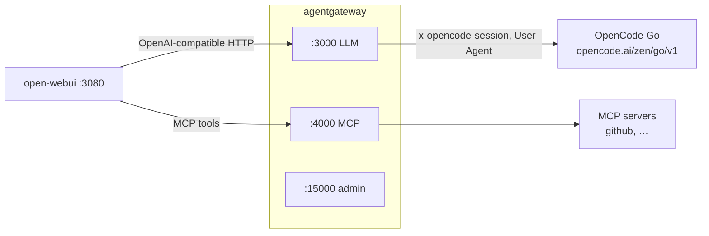
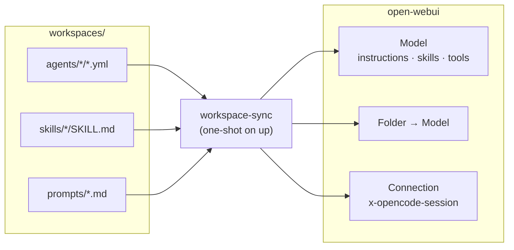

# Architecture

[Home](../README.md) · [Configuration](configuration.md) · [Agents](agents.md) · [Operations](operations.md) · [Troubleshooting](troubleshooting.md)

Two layers: the **gateway** is shared infrastructure, and the **agents** are
per-workspace bundles built on top of it.

## Runtime — the request path



## Provisioning — how this repo reaches the UI



- **Gateway (shared).** The OpenCode Go connection — one API key, one model
  catalog, one `x-opencode-session` policy — plus the MCP servers **every model**
  can call (GitHub, …), multiplexed into a single endpoint on `:4000`. Both are
  declared in `config.yml` (see [Configuration](configuration.md)).
- **Agents (per workspace).** YAML under `workspaces/agents/` — an inline system
  prompt, skills and MCPs — reconciled into an open-webui **Model** and a
  **Folder** bound to it, so each agent is its own entry in the model picker and
  its own place in the sidebar. Agents can share skills (`workspaces/skills/`)
  and extend one another with `extends:` (see [Agents](agents.md)).
- **`workspace-sync`** is the bridge: on every `up` it reads the repo, sets the
  connection's session header, and upserts the models, skills, prompts and
  folders to match.

Any other OpenAI client (a script, an SDK, your own agent) can use
`http://localhost:3000/v1` the same way.

## The per-chat session header

The gateway derives a stable session per conversation from an
`x-opencode-session` header. **`workspace-sync` sets it for you** on open-webui's
OpenAI connection, so there is nothing to do by hand:

```json
{ "x-opencode-session": "{{CHAT_ID}}" }
```

`{{CHAT_ID}}` is interpolated by open-webui per chat. The header lives on the
connection in open-webui's database (the `open-webui` volume) and is re-applied
on every `docker compose up`.

### Setting it by hand

If you are not running the sync, set it manually — **Settings → Admin →
Connections →** your OpenAI connection → **Custom headers**:


set it to the JSON above, save, and click the connection's **refresh** icon so
the model list is re-fetched:


On a fresh install you can also seed it declaratively with open-webui's
`OPENAI_API_CONFIGS` env var, e.g.
`{"0":{"headers":{"x-opencode-session":"{{CHAT_ID}}"}}}` — but it is a persisted
setting, so it is only read while no value is stored.

Without this header the gateway still gives each chat its own session by hashing
the first user message, so it works either way — the header just makes it exact.

### Why the transformation exists

OpenCode Go requires a stable `x-opencode-session` per conversation and returns
`Request is missing x-opencode-session` without one. agentgateway translates the
request into the provider's wire format, which rebuilds the upstream request and
drops client headers — so the gateway re-adds it:

```yaml
policies:
  transformations:
    request:
      set:
        x-opencode-session: |
          coalesce(
            request.headers["x-opencode-session"],
            request.headers["x-openwebui-chat-id"],
            json(request.body).chat_id,
            sha256.encode(string(json(request.body).messages.filter(m, m.role == "user")[0].content)),
            uuid()
          )
        User-Agent: '"agent-gateway/1.0"'
```

Priority order, first match wins (`coalesce` swallows errors from earlier branches):

1. an explicit `x-opencode-session` from the client (your own agent, or open-webui
   once the custom header is set),
2. open-webui's built-in `x-openwebui-chat-id` header,
3. a `chat_id` carried in the request body,
4. a SHA-256 of the **first user message** — stable across turns because the
   message history only appends, so any client gets a working per-chat session
   with zero configuration,
5. `uuid()` — only if the content cannot be hashed (e.g. multimodal message parts).

### Multimodal caveat

Multimodal messages (content as a list) fall through to a random `uuid()`
session, so they do not share a prompt cache. To keep those stable too, hash the
first text part instead of the raw content in the `coalesce` chain.
